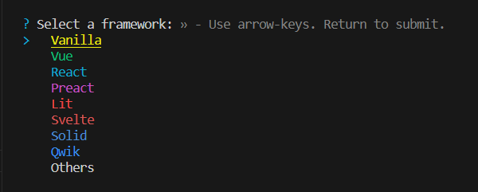

# Inicializar React con Vite sin plantillas
A veces no nos permiten usar una plantilla de React y debemos crear una aplicación y su punto de entrada desde cero.

Vamos a dar los pasos mínimos para construir desde cero una aplicación React.

## Inicializar plantilla Vanilla con Vite

Lo primero que haremos, desde la consola en windows, accederemos a nuestra carpeta proyectos,  será donde crearemos nuestra aplicación React. Si no la tenemos la creamos y entramos dentro.

```
mkdir projects
cd projects
```

En este momento usaremos ``vite`` para usar una plantilla pero sólo con ``Vanilla`` y sin usar la plantilla de ``React`` :

```
npm create vite@latest
```
Nos pedirá nuestro nombre de proyecto, y posteriormente que indiquemos el ``framework``, en nuestro caso seleccionaremos ``Vanilla``.



Seguidamente, nos indicará el lenguaje, donde para el ejemplo seleccionaremos ``JavaScript``.


Con todo esto, aceptaremos y se nos desplegará nuestro nuevo proyecto en la carpeta que hubieramos indicado como nombre de proyecto en el paso inicial.

Para el siguiente paso deberemos entrar en nuestra carpeta de proyecto y proceder con la instalación.

## Instalar Plugin de React
Instalaremos el plugin de react. Usaremos el modificador ``-E``, equivalente a ``--save-exact``, para que guarde en nuestro package.json las versiones exactas que hemos instalado.

```
cd mi-proyecto
npm install @vitejs/plugin-react -E
```

Procederemos a entrar en nuestro editor de texto favorito. En mi caso a partir de este momento las instrucciones son para ``vscode``. Lo haremos desde la consola y dentro de la carpeta de nuestro proyecto.

```
cd mi-proyecto
code .
```

Se nos abrirá el editor y podremos ver los archivos que nos crea la plantilla.


## Instalar dependencias React

Ya tenemos nuestra 

Instalaremos ahora las dos únicas dependencias que necesitamos, ``React`` el paquete principal y ``ReactDom`` que contiene los enlaces con el navegador.

```
npm install react react-dom -E
```

Nuevamente usaremos el modificador ``-E`` para que ``npm`` nos guarde las versiones exactas instaladas. 

## Configuración de vite
Ahora lo que debemos hacer es crear nuestra configuración de vite.

Para ello crearemos en la raiz de nuestro proyecto un archivo llamado ``vite.config.js``. Podemos encontrar más información al respecto en su [página web](https://es.vitejs.dev/config/) :

```
import { defineConfig } from 'vite'
import react from '@vitejs/plugin-react'

export default defineConfig({
  plugins: [react()]
})
```

Básicamente hemos configurado ``vite`` para que use su plugin de ``React`` que previamente hemos instalado en pasos anteriores. Todo esto nos va a permitir crear el punto de entrada de nuestra aplicación.

Estamos listos para crear el punto de entrada de nuestra aplicación.

# Crear punto de entrada React
Si revisamos nuestro página principal ``index.html`` veremos que ejecuta el script ``main.js``, es por tanto allí donde debemos crear nuestro punto de entrada a ``React``.

Abriremos el archivo main.``main.js`` y vaciaremos su contenido.

1. Importaremos ``createRoot`` desde el paquete ``react-dom/client``
2. En nuestro ``index.html`` buscaremos el ``id`` del elemento ``div`` principal, en nuestro caso ``app``. 
3. Usaremos este identificador para establecer el objeto ``root`` que contendrá el nodo principal con la función ``createRoot`` que importamos en el paso anterior y que nos permitirá renderizar el resto de nuestra aplicación React.
4. Renderizamos un texto de ejemplo para mostrar algo en nuestro página inicial.

Nuestro archivo main.js debe quedar de esta forma:

```
import { createRoot } from 'react-dom/client'

const root = createRoot(document.getElementById('app'))
root.render(<h1>Hola Fran !</h1>)
```

## Ejecutar nuestra aplicación
Si revisamos nuestro archivo ``package.json`` veremos que con el comando ``dev`` podemos èjecutarr nuestro proyecto con ``vite``. Nos iremos a la consola y ejecutaremos:

```
npm run dev
```

Como vemos nos muestra un error con los archivo jsx que debemo solucionar.


Básicamente, nos está indicando un archivo ``js``, en el que estamos usando código ``jsx``, y que por tanto debemos renombrar con dicha extensión. Evidentemente tendremos que modificar también el enlace a dicho script en la página ``index.html``.

Tras estos cambios, si paramos y ejecutamos de nuevo el comando anterior, vemos que ya todo funciona perfectamente. Si accedemos a la ``url`` de nuestro servidor local, veremos nuestra página en ejecución en el navegador.


## ANEXO: Activar un linter en visual studio code

A partir de este momento para garantizar que el editor nos ayuda con errores, advertencias y estilo de código, instalaremo su ``linter``, en mi caso ``StandardJS``.

Es necesario tener previamente instaladas dos extensiones en vscode, en caso de no tenerlas, procederemos a acceder a la pestaña de extensiones e instalarlas:

- ESLint de Microsoft


- StandardJS - JavaScript Standard Style de Standard


Estamos preparados para instalar ``StandardJS``, puedes ampliar información en su [web](https://standardjs.com/). Nosotros lo instalaremos __localmente__ en el proyecto que estamos trabajando, puedes consultar como hacerlo de manera global.

```
npm install standard --save-dev
```

Esta instrucción comienza a usar el gestor de paquetes ``npm`` para instalar ``StandarJS`` como  __dependencia de desarrollo__ en nuestro proyecto. Tras unos segundos de descargar e instalar dependencias el proceso finaliza.

Si consultamos en nuestro proyecto el archivo de configuración de paquetes ``package.json``, deberíamos ver ya, nuestras dos dependencias de desarrollo que hemos usado: ``vite`` y ``StandardJS`` con sus correspondientes versiones y en las dependencias del proyecto las tres dependencias relacionadas con ``react`` que hemos instalado.

para que funcione correctamente con componentes react deberemos además hacer un pequeño cambio en nuestra configuración:

```
  "eslintConfig": {
    "extends": "./node_modules/standard/eslintrc.json"
  }
```

Finalmente el archivo package.json debería, salvo versiones instaladas, el siguiente:

```
{
  "name": "mi-proyecto",
  "private": true,
  "version": "0.0.0",
  "type": "module",
  "scripts": {
    "dev": "vite",
    "build": "vite build",
    "preview": "vite preview"
  },
  "devDependencies": {
    "standard": "^17.1.0",
    "vite": "^5.0.8"
  },
  "dependencies": {
    "@vitejs/plugin-react": "4.2.1",
    "react": "18.2.0",
    "react-dom": "18.2.0"
  }, 
  "eslintConfig": {
    "extends": "./node_modules/standard/eslintrc.json"
  }
}
```