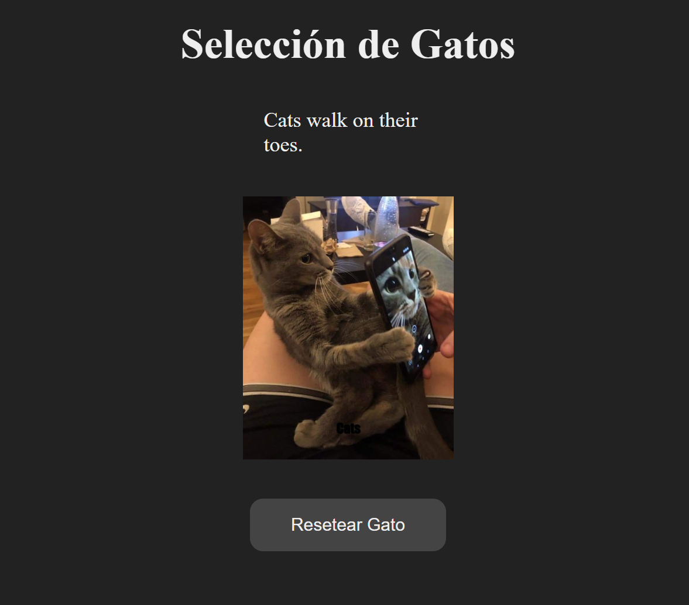

# Buscando Gatos en una API

Proyecto básico que hace una petición a un API a partir de los resultados obtenidos de una API anterior.

Es una prueba de concepto, no está estilada.

Basado en el proyecto original de [midudev](https://github.com/midudev/aprendiendo-react), con algún ligero cambio.

