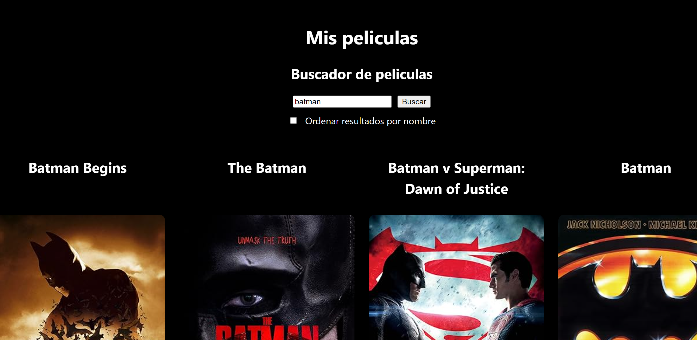

# Buscador de películas

Proyecto básico que hace una petición a un API de películas a partir de un campo de texto que rellena el usuario.

Basado en el proyecto original de [midudev](https://github.com/midudev/aprendiendo-react), con algún ligero cambio.

