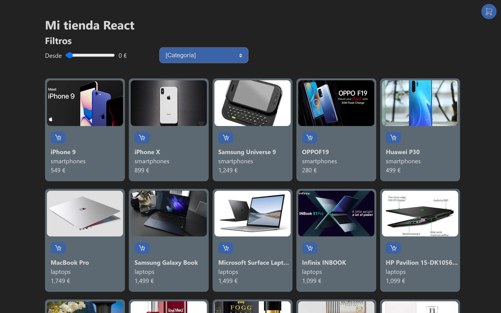
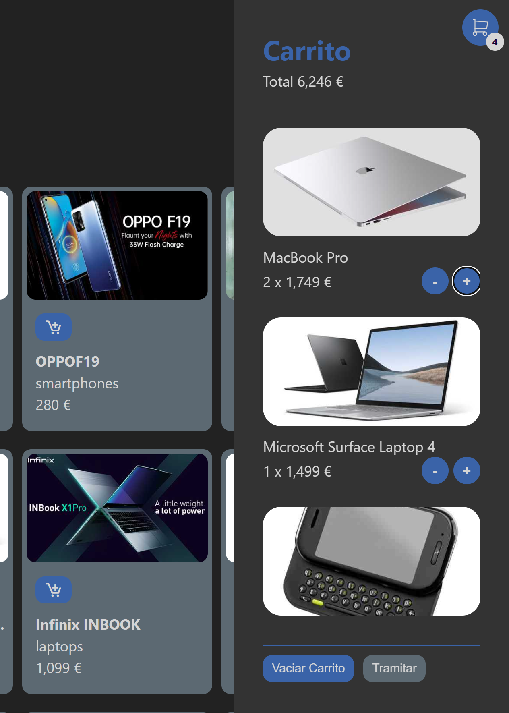

# Lista de productos
Prueba de concepto de una lista de comercio electrónico.

Productos de una [tienda](https://fjespina-sample-store.netlify.app/) realizada en React y Vanilla JavaScript partiendo de la plantilla de Vite + React. Actualmente desplegada en [netlify](https://fjespina-sample-store.netlify.app/).

A partir de una prueba técnica en el canal de [midudev](https://github.com/midudev), se crea desde cero la web ampliando los conceptos que se muetran en el repositorio original.

La tienda consta de una lista de productos, que se obtienen con un feecth de datos inicial a través de la API de [dummyjson](https://dummyjson.com) y que se muestran en forma de grid al usuario.

La tienda dispone de una simulación de funcionalidad de compra. 

## Filtro de productos
El usuario puede filtrar los productos que ve en la lista a través del uso de dos campos que permiten filtrar por precio y por categoría.

Por simplicidad, el precio determina el importe desde el que se muestran productos. Se muestran todos los productos que tienen un precio mayor o igual al que hemos indicado. Se ha usado un ``input`` de tipo rango, mediante el uso de debounce, solo se produce el filtro de productos cuando el usuario deja de mover el rango.

Para el filtro de categorías se usa un ``select``. Las categorías que se muestran se calculan al inicio de la carga de la web en función de los productos cargados de la API. 

## Carrito

El usuario puede ``añadir`` productos al carrito.

Una vez que se ha añadido un producto, aparece un botón ``eliminar`` en la tarjeta del producto. Ese botón permite eliminar el producto completo del carrito (todas sus unidades).

Si volvemos a pulsar el botón añadir sobre un producto que ya esté en el carrito, la lógica aumenta en una unidad el producto en el carrito. Si el producto no existen en el carrito las unidades se inicializan a 1. 

Desde el botón del carrito podremos mostrar u ocultar el carrito, de modo que podremos consultar los productos que hemos ido añadiendo y revisar el importe total del carrito.

En cada producto aparece el número de unidades añadidas y dos botones que nos permiten añadir o eliminar unidades. En caso de eliminar la última unidad, el producto desaparece del carrito.

El carrito dispone de scroll vertical, lo que nos permite consultar el carrito incluso si el número de productos es elevado. Además al mostrarse el carrito, el scroll automáticamente se establece al inicio de la lista. 

Del mismo modo, mientras tenemos abierto el carrito se invalida el scroll de la lista de productos que está de fondo, actuando el carrito como una ventana modal.

Los productos añadidos al carrito de guardan en el almacenamiento local del dispositivo. Mediante los botos ``vaciar carrito`` o ``tramitar`` podemos limpiar el almacenamiento y reinicializar el carrito.

## Lista de conceptos probados
- Fetchinig de datos a traves de una API.
- Uso de estados y efectos de React para mejora del rendimiento.
- Uso de un reducer de React para encapsular funcionalidad
- Uso de servicios y custom hooks para agrupar la funcionalidad.
- Uso de contextos de React para el uso compartido de estados en la web.
- Debouncing de datos con el paquete [just-debounce-it](https://www.npmjs.com/package/just-debounce-it) para evitar lógica innecesaria al filtrar por precio
- Reponsive
- Grid con scroll tanto en productos como carrito con anulación del scroll principal cuando el carrito está abierto y reinicio de scroll vertical mediante JS.
- Almacenamiento local del carrito en el dispositivo
